# Мзико: руководство для родителей

Мзико учит ребёнка грузинским буквам, слогам и словам по карточкам с картинкой и
звуком. За верные ответы ребёнок получает монеты, в воскресенье монеты
превращаются в лари, а вы выдаёте их наличными. Ребёнок занимается в приложении
на планшете или телефоне, вы управляете всем через Telegram-бота.

Участников двое: **ребёнок** видит только приложение, **родитель** видит только
бота. Ниже описано и то, и другое, чтобы вы понимали, что происходит у ребёнка на
экране.

---

## 1. Быстрый старт за пять минут

1. **Напишите боту `/start`** и ответьте на два вопроса: как вас зовут и как зовут
   ребёнка. Можно нажать кнопку «Я — Имя Фамилия» вместо набора имени.
2. **Получите код входа.** Бот сразу пришлёт код вида `LOMI-7241` и ссылку.
3. **Откройте ссылку на устройстве ребёнка** или введите код на экране входа
   приложения. Ребёнок увидит «Привет, Сандро!» и главный экран.
4. **Добавьте приложение на экран «Домой»** (Safari → «Поделиться» → «На экран
   Домой»), чтобы оно открывалось как обычное приложение с иконкой Мзико.
5. **В воскресенье в 20:00** вам придёт отчёт: сколько дней занимался, сколько
   слов выучил, сколько лари заработал. Выдайте деньги и нажмите «Выплачено».

Всё остальное в этом документе — подробности каждого шага.

---

## 2. Бот: команды и кнопки

Бот отвечает только зарегистрированным родителям. Незнакомцу на любую команду,
кроме `/start` и `/help`, он не ответит вообще.

### Регистрация: `/start`

Диалог из двух вопросов. Пример:

> **Вы:** /start
> **Бот:** Привет! Я Мзико, бот для родителей. Здесь вы добавляете ребёнка,
> выдаёте ему код для входа в приложение и видите, сколько слов он выучил и
> сколько лари заработал. Два вопроса, и готово. Как вас зовут?
> *[кнопка: Я — Нино Беридзе]*
> **Вы:** Нино
> **Бот:** Записал: **Нино**. Как зовут ребёнка? С этим именем приложение будет
> с ним здороваться. Если ребёнок уже занимается у другого родителя, пришлите
> вместо имени его код, например LOMI-7241.
> **Вы:** Сандро
> **Бот:** Готово! Вы в Мзико как **Нино**, добавил: **Сандро**.
> Дальше: /settings — курс, лимит, подсказка; /report — итоги недели…
> **Бот:** Код для входа Сандро: **LOMI-7241**. Ссылка для входа: https://…/c/LOMI-7241 …

Что полезно знать:

- Имя ребёнка появится в приложении: «Привет, Сандро!».
- Если у ребёнка уже есть аккаунт (его завёл второй родитель), на второй вопрос
  пришлите **код ребёнка** вместо имени. Вы подключитесь к тому же ребёнку, и
  прогресс у вас будет общий. Код можно писать как угодно: `LOMI-7241`,
  `lomi 7241`, `LOMI7241`.
- Стикер, голосовое или фото бот не примет: «Нужен текст».
- Ушли посреди регистрации? Напишите `/start` снова, бот продолжит с того места,
  где остановились: «С возвращением! Остался один вопрос».
- `/cancel` прерывает регистрацию. `/help` показывает список команд.

### Список команд

| Команда | Что делает |
|---|---|
| `/report` | Итоги текущей недели: дни, выученные слова, монеты и лари, кнопка «Выплачено» |
| `/progress` | Прогресс по каждой теме и каждому слову |
| `/settings` | Курс монет, недельный лимит, подсказка кириллицей |
| `/code` | Код и ссылка для входа ребёнка, кнопка «Новые цифры» |
| `/devices` | Устройства, на которых ребёнок вошёл, с кнопкой «Отключить» |
| `/reset` | Сбросить прогресс ребёнка или отключить ребёнка от себя |
| `/addchild Имя` | Добавить ещё одного ребёнка |
| `/addchild LOMI-7241` | Подключить уже существующего ребёнка по его коду |
| `/help` | Список команд |

Если у вас **несколько детей**, на каждую команду бот сначала спросит «Кто?» и
покажет кнопки с именами. Нажмите нужную, и команда выполнится для этого ребёнка.

### `/code`: вход ребёнка

Бот показывает код, ссылку и короткую инструкцию:

> Код для входа Сандро: **LOMI-7241**
> Ссылка для входа: https://mziko.example.com/c/LOMI-7241
> Ребёнок вводит код на экране входа на любом устройстве, или откройте ссылку там.
> Три ошибки подряд закрывают вход на час; «Новые цифры» открывают его сразу и
> меняют цифры (слово остаётся).
> *[кнопка: Новые цифры]*

- Код **постоянный**: слово из четырёх латинских букв даётся один раз и не
  меняется, четыре цифры вы можете перевыпустить кнопкой «Новые цифры».
- Код **многоразовый**: им можно войти на планшете, телефоне мамы и телефоне
  бабушки. Прогресс и монеты у ребёнка одни на всех устройствах.
- Знание кода равно доступу к ребёнку: не публикуйте его в общих чатах.

**Ребёнок ошибся три раза подряд.** Вход с этого устройства закрывается на час,
на экране появляется таймер и подсказка позвать родителей. Нажмите «Новые цифры»
в `/code`: блокировка снимется сразу, ребёнок увидит «Код открыт! Цифры теперь
новые — посмотри в Telegram», и вы продиктуете новые цифры. Если ребёнок три
раза ошибся в самих **буквах** кода, снять блокировку нечем: она пройдёт сама
через час.

### `/devices`: устройства ребёнка

> Устройства Сандро:
> • iPad — с 14.09.2026, был 27.09 18:40
> • Safari — с 20.09.2026, был 21.09 09:12
> *[кнопка: Отключить: iPad (14.09)]* *[кнопка: Отключить: Safari (20.09)]*

«Отключить» разлогинивает устройство: при следующем открытии приложения оно
покажет экран входа. Так убирают потерянный планшет или телефон, которым больше
не пользуются. Прогресс не трогается. Если устройств нет, бот напомнит про `/code`.

### `/settings`: курс, лимит, подсказка

> **Настройки Сандро**
> Курс: 10 монет = 1 ₾
> Лимит: до 15 ₾ в неделю
> Подсказка кириллицей: вкл
> *[Курс, монет за 1 ₾:]* `5` `✓ 10` `15` `20` `30`
> *[Лимит в неделю, ₾:]* `5` `10` `✓ 15` `20` `30`
> *[Подсказка кириллицей: вкл ✓]*

- **Курс** — сколько монет стоит один лари. Курс 10 значит 10 монет = 1 ₾.
  Хотите платить меньше за те же успехи — поставьте 20 или 30.
- **Лимит** — потолок выплаты за неделю в лари. Монеты сверх лимита не
  начисляются, в отчёте появится пометка «(достигнут лимит)».
- **Подсказка кириллицей** — показывать ли под грузинским словом его
  приблизительное чтение русскими буквами («ძაღლი — дзагли»). Когда ребёнок
  начнёт читать по-грузински сам, подсказку можно выключить.

Настройки применяются сразу, кнопка «Сохранено» подтверждает. Смена курса
посреди недели меняет пересчёт монет в лари для этой недели: монеты остаются,
сумма в лари пересчитывается по новому курсу.

### `/report` и воскресный отчёт

Отчёт приходит сам каждое **воскресенье в 20:00 по Тбилиси** всем родителям
ребёнка. В любой другой момент его можно запросить командой `/report`.

> **Неделя 21.09–27.09: итоги Сандро**
> Занимался 5 из 7 дней
> Выучено слов: 4 (🐶 🍎 ☀️ 🏠)
> Монет: 37 → **3,7 ₾**
> Выдайте наличные и нажмите «Выплачено».
> *[Выплачено]* *[Слова недели]*

- **«Выплачено»** закрывает неделю: сообщение меняется на «✅ Выплачено 3,7 ₾».
  Нажать дважды нельзя: второе нажатие ответит «Уже было выплачено: 3,7 ₾».
- **«Слова недели»** присылает список слов, выученных за неделю, с чтением и
  переводом:
  > Слова недели:
  > 🐶 **ძაღლი** — дзагли · собака
  > 🍎 **ვაშლი** — вашли · яблоко
- **Забыли нажать «Выплачено»?** Ничего не потеряется. Новая неделя всё равно
  начнётся с нуля, а старая появится в следующих отчётах отдельной строкой:
  > К выплате за прошлые недели:
  > • 14.09–20.09 — 5,2 ₾ (52 монеты)
  > *[Выплачено за 14.09–20.09]*

«Занимался N из 7 дней» считает дни, в которые ребёнок довёл занятие до конца,
до экрана «Ура, занятие готово!». Прерванное на середине занятие день не
засчитывает.

### `/progress`: прогресс по словам

Бот показывает все темы по порядку, внутри каждой все слова с тремя точками:

> **Прогресс Сандро**
>
> 🔤 **Буквы 1** — 6 из 8
> ●●● ა · буква а
> ●●● ი · буква и
> ●●○ თ · буква т
> ○○○ ს · буква с
> …
> 🐶 **Первые слова** — 2 из 12
> ●●● ძაღლი · собака
> ●○○ კატა · кошка
> …

Точки — это ступени слова. Ступень растёт на единицу за верный ответ, но не
чаще **одного раза в день**. Три ступени `●●●` означают: ребёнок ответил верно в
три разных дня, слово выучено. Сообщение длинное, тем 19 и карточек 228.

### Несколько детей и второй родитель

- **Второй ребёнок:** `/addchild Лиза`. Бот ответит «Добавил: Лиза. Код для
  входа: /code». Дальше на каждую команду бот будет спрашивать «Кто?».
- **Второй родитель** (папа, бабушка): пусть напишет боту `/start`, назовёт себя
  и на вопрос об имени ребёнка пришлёт **код** ребёнка из вашего `/code`. Он
  увидит того же ребёнка, те же настройки и получит тот же воскресный отчёт.
  «Выплачено» нажимает любой из вас, один раз на неделю.
- **Подключить ребёнка** уже зарегистрированному родителю: `/addchild LOMI-7241`.

### `/reset`: сброс и отключение

Обе операции требуют подтверждения кнопкой, до неё ничего не меняется.

> Что сделать с Сандро?
> *[Сбросить прогресс]* *[Отключить ребёнка]* *[Отмена]*

- **Сбросить прогресс.** Уходят все выученные слова, занятия, монеты и недели.
  Ребёнок, его код и вошедшие устройства остаются: планшет просто начнёт с
  первого урока, входить заново не нужно. Пригодится, если приложение начнёт
  младший ребёнок под тем же именем или вы хотите пройти всё с чистого листа.
- **Отключить ребёнка.** Удаляется только связь между вами и ребёнком: он
  пропадает из ваших команд и воскресных отчётов. Сам ребёнок с прогрессом,
  кодом и устройствами остаётся, у второго родителя ничего не меняется. Бот
  напомнит дорогу назад: «Подключить обратно: /addchild LOMI-7241».

---

## 3. Приложение ребёнка: что он видит

### Вход

Экран входа — восемь клеток и своя экранная клавиатура: сначала латинские буквы,
после четвёртой она сама переключается на цифры. Системная клавиатура не
вызывается, чтобы планшет не подсовывал кириллицу и автозамену. Кнопка «Войти»
загорается, когда набраны все восемь знаков.

- **Ссылка из бота** входит без набора: «Проверяем код…», затем «Привет, Сандро!».
- **Ошибка**: цифры подсвечиваются, «Не тот код», показано, сколько попыток
  осталось. Перед третьей: «Последняя попытка — потом код закроется на час».
- **Блокировка**: после трёх ошибок таймер на час и подсказка попросить
  родителей. Как снять, описано в разделе `/code`.
- После успешного входа устройство запоминается, экран входа больше не
  показывается. Исключение: на iPad и iPhone иконка на «Домой» и Safari хранят
  данные раздельно, поэтому после установки иконки код вводится ещё один раз.

<figure>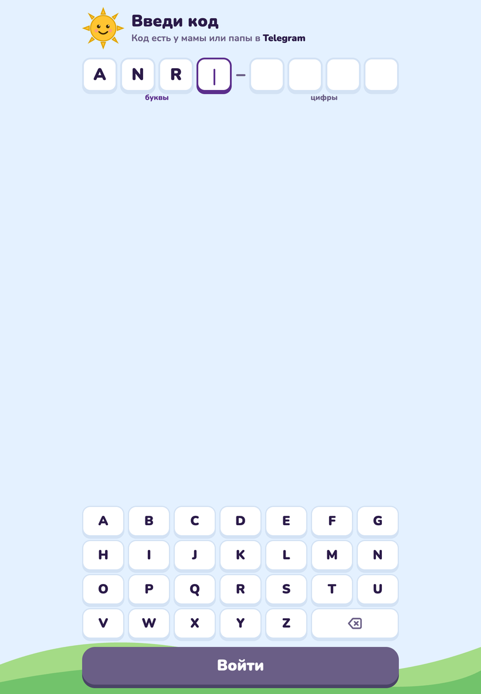<figcaption>Экран входа: набраны три буквы, клавиатура ещё буквенная</figcaption></figure>
<figure>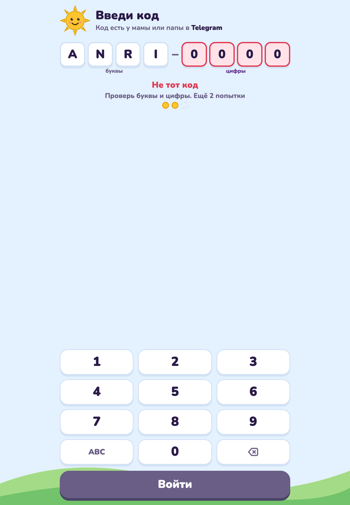<figcaption>Ошибка: цифры подсвечены, показано, сколько попыток осталось</figcaption></figure>

### Главный экран

- **Мзико и приветствие** «გამარჯობა!» с именем ребёнка.
- **Копилка**: монеты текущей недели и подпись «это 3,7 ₾ на сладости». Это те же
  цифры, что в вашем `/report`. В понедельник копилка обнуляется, новая неделя.
- **Семь кружков недели**: звёздочка за каждый день с законченным занятием.
- **Карточка урока на сегодня**: тема, которую ребёнок выбрал сегодня, «показано
  6 из 8», полоска прогресса и большая кнопка «Играть». Когда все слова урока
  показаны, кнопка меняется на «Повторить» и появляется подпись «Новый урок —
  завтра». Если сегодня ещё ничего не выбрано, вместо карточки приглашение
  «Выбери урок на сегодня» и кнопка «К урокам».
- **Строка «Другие уроки»** ведёт на экран «Уроки».
- **Наклейки**: все 228 карточек лентой, выученные цветные, остальные серые, и
  счётчик «12 слов выучено».
- **Меню** (кнопка-«бургер» вверху справа): пункты «Уроки» и «Настройки · скоро».

Когда все уроки пройдены, на месте карточки надпись «Всё закреплено!» и кнопка
«Повторить слова»: занятие только из повторений.

<figure>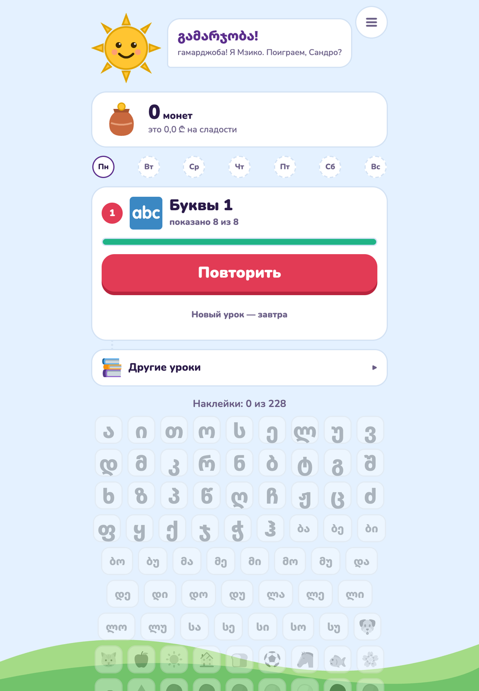<figcaption>Утро: урок ещё не выбран, копилка пустая, наклейки серые</figcaption></figure>
<figure>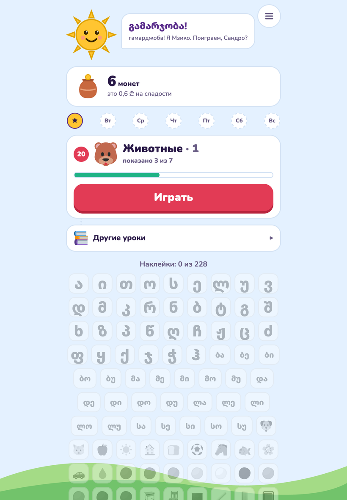<figcaption>После занятия: звёздочка за день, монеты, карточка темы дня</figcaption></figure>
<figure>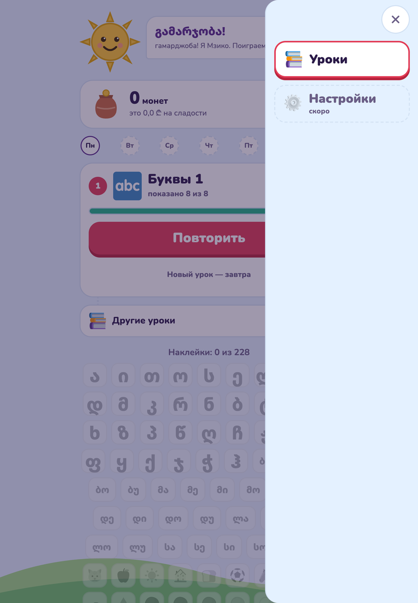<figcaption>Меню: «Уроки» и «Настройки · скоро»</figcaption></figure>

### Экран «Уроки»: три раздела и правило дня

Подсказка Мзико наверху: «Каждый день — одна тема из каждого раздела».

| Раздел | Темы | Уроков |
|---|---|---|
| Буквы | Буквы 1, 2, 3, 4 | по одному на тему |
| Слоги | Слоги | 3 |
| Слова | 14 словарных тем | 1–2 на тему |

Как это работает:

- **В день одна тема из каждого раздела.** Первое занятие по теме делает её
  «темой дня» в своём разделе, остальные темы раздела закрываются замком с
  подписью «завтра». Разделы друг другу не мешают: за день можно пройти
  «Буквы 2», «Слоги» и «Еду».
- **Внутри темы уроки по порядку.** «Еда · 2» откроется после «Еда · 1», оба
  можно пройти за один день. Порядок тем в разделе «Слова» не навязан: ребёнок
  может начать с «Животных», а «Цвета» взять потом.
- **Повторять можно всегда.** Пройденную раньше тему можно выбрать темой дня
  снова: все её уроки станут «Повторить». Монеты за повтор платятся по обычному
  правилу: раз в день за слово.
- **Три новых карточки за заход.** Урок из восьми слов проходится за три захода
  в один день или за три дня, как удобно ребёнку.

Пример недели: в понедельник ребёнок берёт «Буквы 1» и «Первые слова», во вторник
«Буквы 1» ещё раз (доучить оставшиеся буквы) и «Цвета», в среду «Слоги» и снова
«Первые слова», потому что там ещё есть непоказанные слова.

<figure>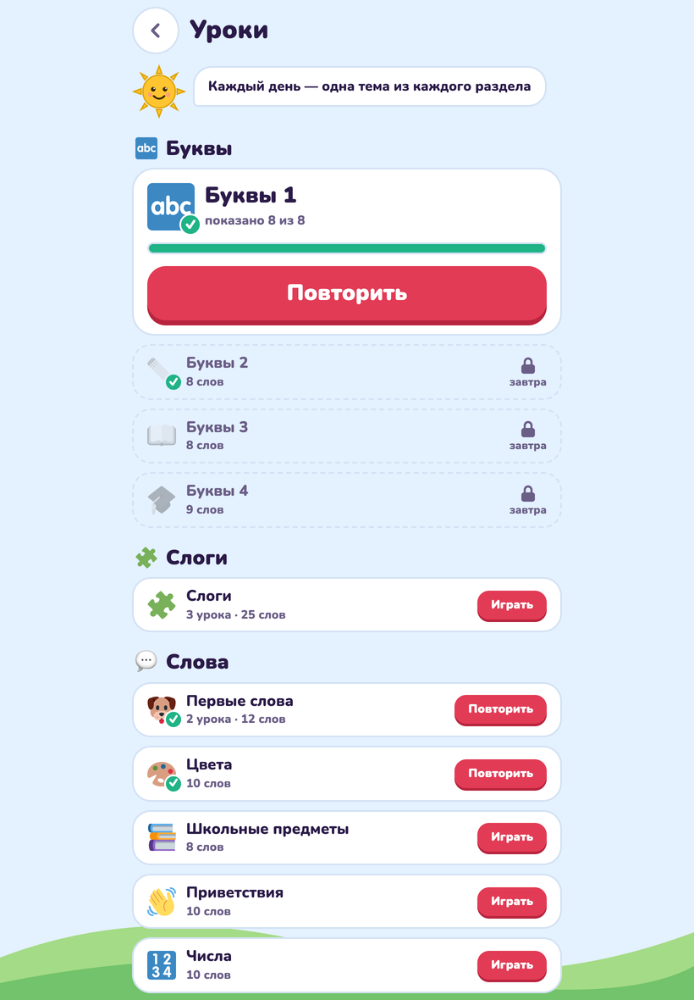<figcaption>Утром открыты все темы: галочка у пройденных, «Повторить» вместо «Играть»</figcaption></figure>
<figure>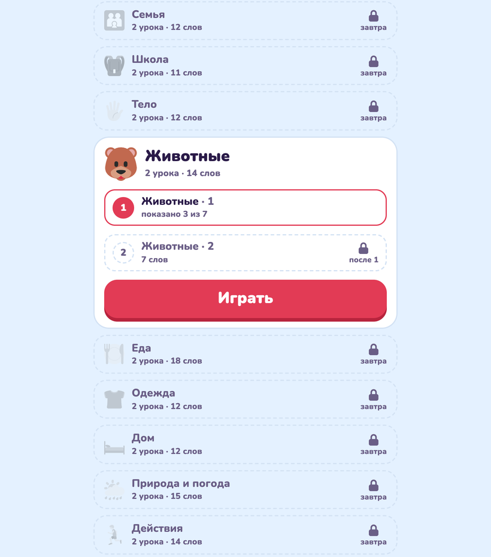<figcaption>После занятия по «Животным»: тема раскрыта, второй урок «после 1», остальные темы раздела до завтра</figcaption></figure>

### Занятие

Занятие занимает 5–7 минут: сверху крестик (выйти), полоска прогресса и
мини-копилка. Три вида шагов:

1. **Знакомство.** «Новое слово!» или «Новая буква!»: большая картинка или
   буква, грузинское слово, подсказка кириллицей (если включена), звук. Для
   буквы ещё опорное слово: «ბ как в ⚽ ბურთი». Кнопка «Дальше».
2. **«Послушай и найди».** Звучит слово, ребёнок выбирает из четырёх картинок.
   Для букв и слогов вместо картинок четыре написанных буквы или слога: так
   учат различать похожие формы ბ, დ, ლ, მ. Кнопка «Послушать ещё раз».
3. **«Вспомни слово».** Показана картинка, ребёнок выбирает одно из трёх
   грузинских слов, у каждого своя кнопка озвучки. Для букв и слогов этот шаг
   не даётся, картинка и ответ совпали бы.

Что происходит при ответе:

- **Верно.** На карточке загорается большая зелёная галочка, голос говорит
  «სწორია! ყოჩაღ!» (правильно, молодец), монеты летят в копилку. За выученное
  слово тост «Слово выучено! +6 🪙».
- **Неверно.** Красная тряска, «Почти! Попробуй ещё», голос говорит «არა, ეს
  არასწორია. სცადე კიდევ.» (нет, неправильно, попробуй ещё). Неверный вариант
  гаснет, ребёнок пробует снова. Ничего не отнимается, но монета за этот шаг
  уже не даётся.
- **Итог.** «Ура, занятие готово!», монеты за занятие, «В копилке 37 монет —
  это 3,7 ₾», новые наклейки и кнопка «Домой». Именно этот экран ставит
  звёздочку дня.

Если сети нет, ответы ждут и отправляются повторно; после нескольких неудач
появится «Нет связи. Проверь интернет» с кнопкой «Повторить». Монеты не теряются
и не удваиваются.

<figure>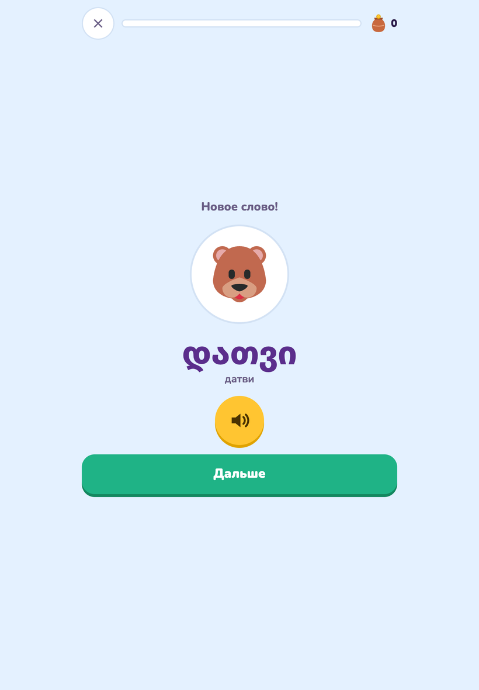<figcaption>Знакомство: картинка, слово, подсказка кириллицей, звук, «Дальше»</figcaption></figure>
<figure>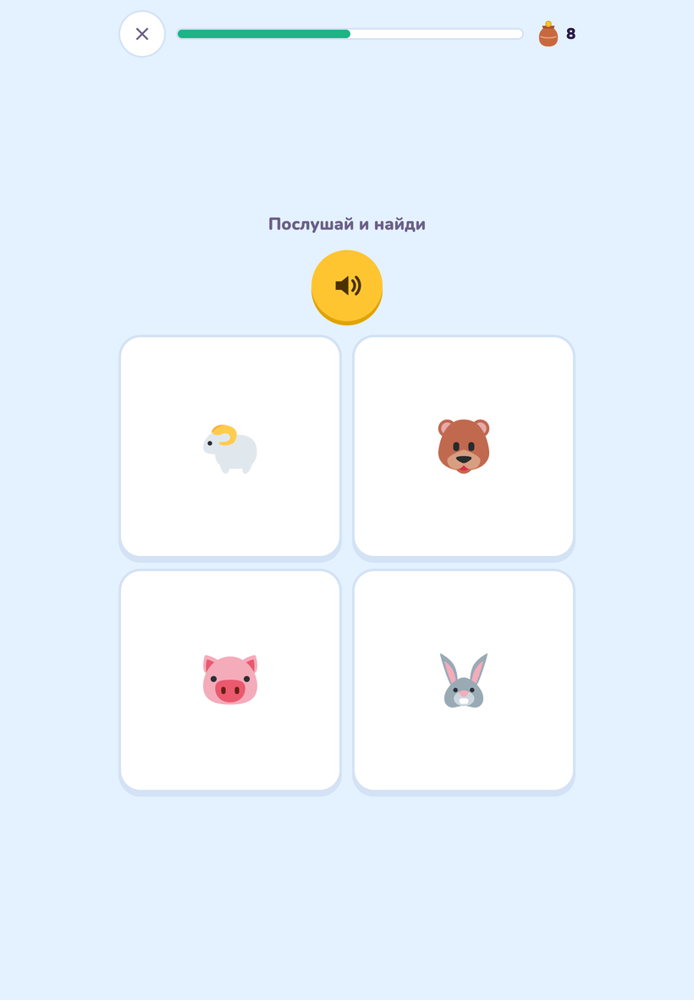<figcaption>«Послушай и найди»: звучит слово, четыре картинки из той же темы</figcaption></figure>

<figure>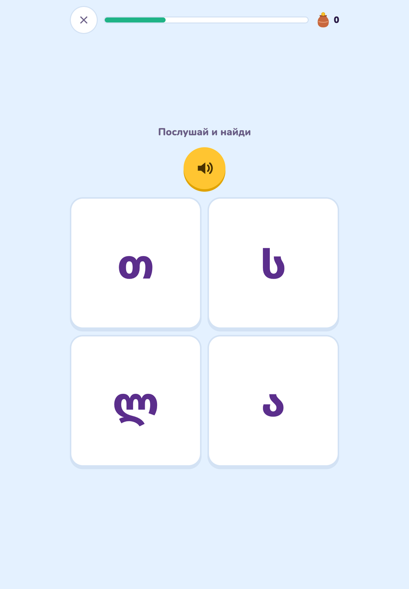<figcaption>То же для букв: четыре похожие буквы вместо картинок</figcaption></figure>
<figure>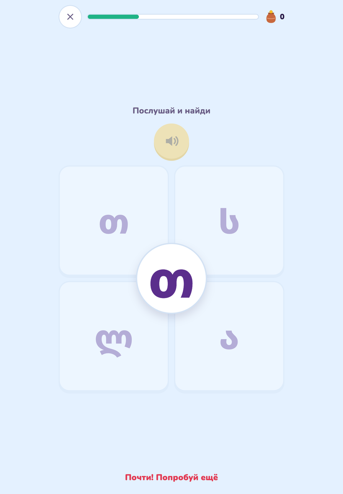<figcaption>Неверно: красная карточка, «Почти! Попробуй ещё», вариант гаснет</figcaption></figure>

<figure>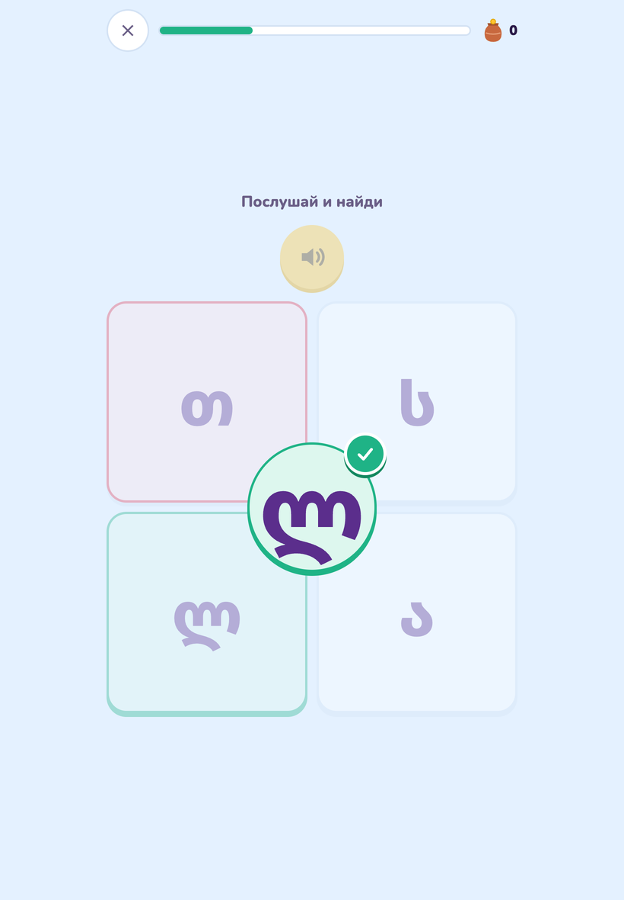<figcaption>Верно: зелёная галочка на выбранной карточке</figcaption></figure>
<figure>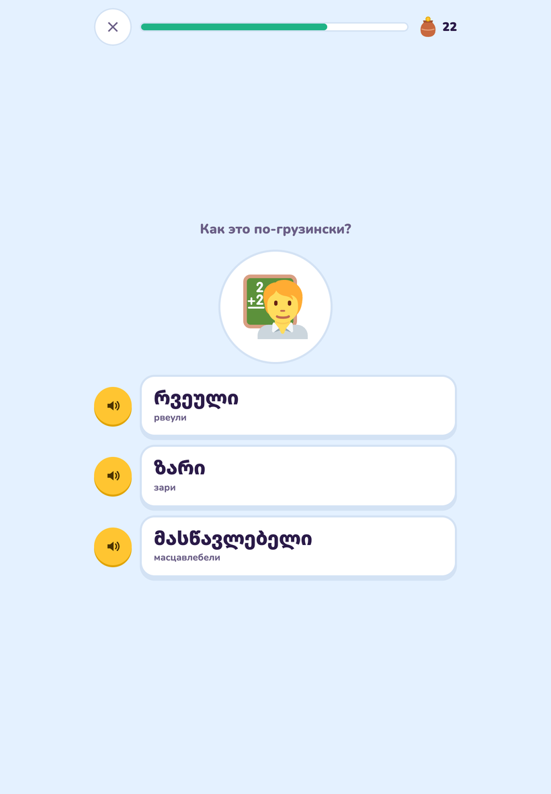<figcaption>«Вспомни слово»: картинка и три слова, у каждого своя озвучка</figcaption></figure>

<figure>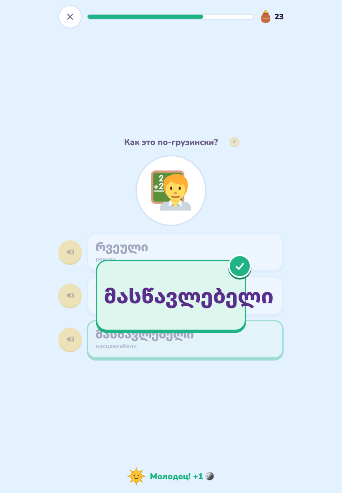<figcaption>Верный ответ: галочка и «Молодец! +1», монета летит в копилку</figcaption></figure>
<figure>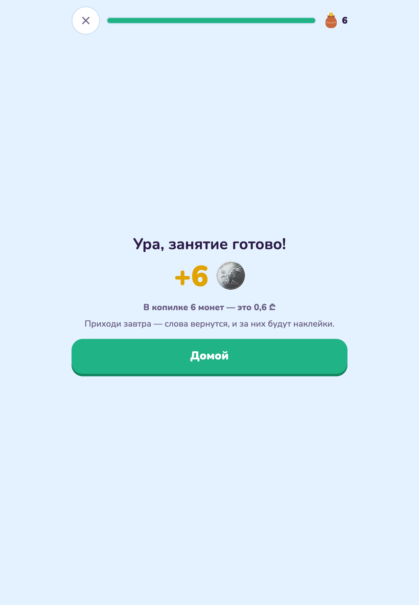<figcaption>Итог: монеты за занятие, сумма в копилке, кнопка «Домой»</figcaption></figure>

### Звук и картинки

Все слова озвучены грузинским голосом. Согласная буква читается слогом с «а» и
опорным словом: «ბა … ბურთი», гласная сама по себе: «ა … ავტობუსი». Картинки
одинаковые на любом устройстве и работают без интернета после первого занятия.

Одна ловушка для русского уха, о которой стоит сказать ребёнку заранее: по-грузински
**მამა** (мама) значит «папа», а **დედა** (деда) значит «мама».

---

## 4. Что учим: программа

Программа повторяет первый класс грузинской школы: 19 тем, 228 карточек, 31 урок.

| Раздел | Тема | Карточек | Что внутри |
|---|---|---|---|
| Буквы | Буквы 1–4 | 33 | Алфавит четырьмя группами в порядке букваря: гласные и частые согласные сначала. У каждой буквы опорное слово |
| Слоги | Слоги | 25 | Пять частых согласных с пятью гласными: ბა, ბე, ბი… Первое чтение |
| Слова | Первые слова 🐶 | 12 | собака, кошка, яблоко, солнце, дом, хлеб, мяч… |
| | Цвета 🎨 | 10 | красный, синий, зелёный… картинка — цветная клякса |
| | Школьные предметы 📚 | 8 | парта, стул, доска, мел, шкаф, книга, полка, стол, с фотографиями |
| | Приветствия 👋 | 10 | გამარჯობა, მადლობა, კი, არა и другие слова вежливости |
| | Числа 🔢 | 10 | от одного до десяти |
| | Семья 👨‍👩‍👧 | 12 | мама, папа, бабушка, дедушка, брат… |
| | Школа 🎒 | 11 | школа, учитель, урок, звонок, рюкзак… |
| | Тело 🖐️ | 12 | голова, глаз, ухо, нос, рот… |
| | Животные 🐻 | 14 | медведь, волк, лиса, заяц, корова… |
| | Еда 🍽️ | 18 | |
| | Одежда 👕 | 12 | |
| | Дом 🛏️ | 12 | |
| | Природа и погода 🌦️ | 15 | |
| | Действия 🏃 | 14 | глаголы: бегать, спать, есть, читать, писать… |

Тема длиннее десяти слов делится на два или три урока: «Еда · 1», «Еда · 2».
По три новые карточки за заход весь путь занимает 76 заходов: примерно два с
половиной месяца по одному заходу в день, или быстрее, если ребёнок берёт по
теме из каждого раздела.

Транскрипции кириллицей приблизительные: грузинские звуки თ/ტ, კ/ქ/ყ, პ/ფ
русскими буквами не различаются. Подсказка нужна на старте, потом её лучше
выключить в `/settings`.

---

## 5. Как считаются монеты и лари

Правила простые, и их стоит один раз объяснить ребёнку.

1. **Монета за верный ответ с первой попытки.** Ошибся и потом угадал — монеты
   нет, но и штрафа нет.
2. **Одна монета за слово в день.** Сколько бы раз ребёнок ни повторял урок за
   день, второй раз то же слово не платит. Повторять можно, зарабатывать на
   повторе одного и того же нельзя.
3. **Ступень растёт раз в день.** Верный ответ поднимает слово на ступень
   (○○○ → ●○○ → ●●○ → ●●●), но не чаще одного раза в день. Поэтому выучить
   слово за один вечер невозможно: нужны три верных ответа в **три разных дня**.
4. **Выученное слово: +5 монет.** Третья ступень даёт бонус, на экране тост
   «Слово выучено! +6 🪙» (монета за ответ плюс пять за слово).
5. **Лари = монеты ÷ курс**, округление вниз до 0,1 ₾, но не больше лимита.
6. **Неделя с понедельника по воскресенье по времени Тбилиси.** В полночь на
   понедельник копилка обнуляется, монеты прошлой недели ждут вашего
   «Выплачено».

Пример при курсе 10 и лимите 15 ₾:

| Что случилось | Монет | В копилке |
|---|---|---|
| Пн: занятие, 7 верных ответов с первой попытки | +7 | 7 |
| Вт: занятие, 6 верных, одно слово дошло до третьей ступени | +6 +5 | 18 |
| Ср: пропустил | 0 | 18 |
| Чт: два занятия, 9 верных ответов, два слова выучены | +9 +10 | 37 |
| Вс 20:00: отчёт | | 37 монет → **3,7 ₾** |

При курсе 20 те же 37 монет дали бы 1,8 ₾. Лимит 15 ₾ при курсе 10 означает
потолок 150 монет в неделю, дальше монеты не начисляются, и в отчёте появится
«(достигнут лимит)».

---

## 6. Установка на планшет и телефон

Мзико — веб-приложение, ставить из App Store ничего не нужно.

1. Откройте ссылку из `/code` в Safari (iPad, iPhone) или Chrome (Android).
2. Войдите по коду или через ссылку.
3. **iPad, iPhone:** «Поделиться» → «На экран Домой». **Android:** меню Chrome →
   «Добавить на главный экран» или «Установить приложение».
4. Откройте иконку Мзико с рабочего стола. На iPad и iPhone код нужно ввести
   ещё один раз: иконка и Safari хранят данные раздельно.

Приложение работает в портретной и альбомной ориентации, подстраивается под
тёмную тему устройства. Картинки и звук уже показанных слов сохраняются на
устройстве, поэтому при слабом интернете занятие не тормозит на загрузке. Совсем
без сети заниматься нельзя: занятие собирает и ответы засчитывает сервер.

---

## 7. Частые ситуации

**Ребёнок говорит, что приложение не даёт новый урок.** Проверьте экран «Уроки»:
скорее всего, в этом разделе тема дня уже выбрана, остальные закрыты замком
«завтра». Можно взять тему из другого раздела или повторить сегодняшнюю.

**Ребёнок прошёл урок, а звёздочки за день нет.** Занятие не было доведено до
экрана «Ура, занятие готово!». Крестик посреди занятия сохраняет монеты за уже
данные ответы, но день не засчитывает.

**Копилка в приложении и отчёт в боте не совпадают.** Они считаются из одних
данных. Закройте и откройте приложение заново: главный экран подтягивает свежие
цифры при открытии.

**Потерялся планшет.** `/devices` → «Отключить» на этом устройстве. Затем
«Новые цифры» в `/code`, чтобы старый код не открыл вход снова.

**Ребёнок сам нашёл код в вашем телефоне и вошёл на другом устройстве.** Это не
страшно: прогресс общий, монеты одни. Лишнее устройство можно отключить.

**Хочу начать всё заново.** `/reset` → «Сбросить прогресс» → «Да, сбросить».

**Хочу, чтобы отчёт получал и второй родитель.** Пусть напишет боту `/start` и
пришлёт код ребёнка вместо имени. Отчёт придёт обоим, «Выплачено» нажимает тот,
кто выдал деньги.

**Не успел нажать «Выплачено» в воскресенье.** Нажмите в любой день: сумма за
прошлую неделю остаётся в отчёте отдельной кнопкой «Выплачено за 14.09–20.09»,
пока не закроете.

**Двое детей на одном планшете.** У каждого свой код. Второму придётся выйти из
первого: отключите устройство первого ребёнка в `/devices` и введите код
второго. Удобнее дать каждому своё устройство: код можно вводить где угодно.

---

## 8. Чего приложение пока не умеет

- Своего экрана настроек у ребёнка нет, всё меняет родитель через бота.
- Нельзя закрыть или открыть отдельную тему по желанию родителя: порядок задаёт
  правило «одна тема раздела в день».
- Нельзя поменять своё имя родителя после регистрации из бота.
- Ребёнок не говорит в микрофон: приложение проверяет узнавание на слух и
  чтение, а не произношение.
- Звук пока синтезирован, записи носителя языка появятся позже; транскрипции
  кириллицей ждут проверки.
- Карточек с фотографией вместо эмодзи пока восемь (тема «Школьные предметы»),
  часть слов без картинки показана крупным текстом.
